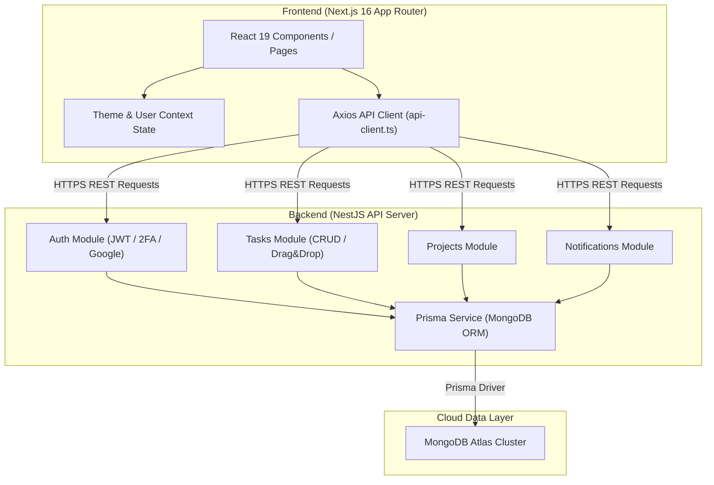
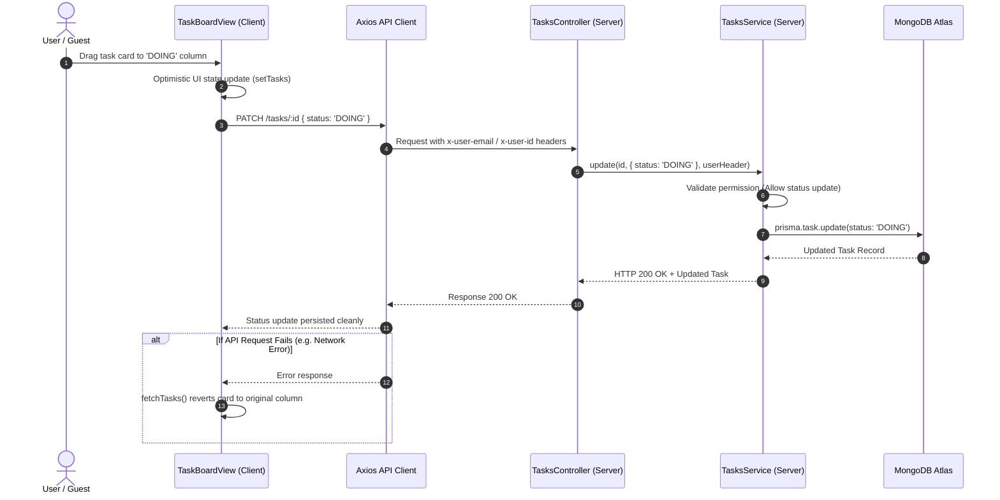
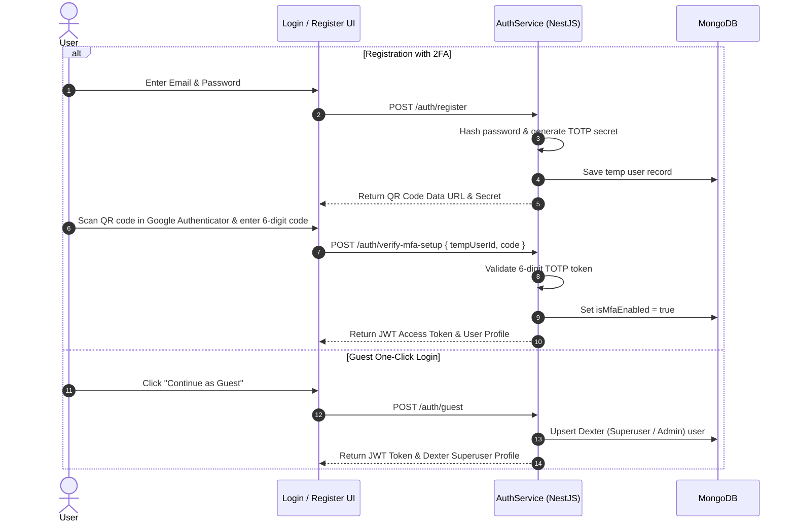

# 🚀 AbleSpace Task Management System

A full-stack, enterprise-grade Task Management Application built with **Next.js 16 (App Router & Turbopack)**, **Tailwind CSS v4**, **NestJS**, **Prisma ORM**, and **MongoDB**. Designed for real-time team collaboration, interactive Kanban boards, subtask tracking, user mentions, and fine-grained role-based permissions.

---

## 📌 Table of Contents

- [Overview](#-overview)
- [✨ Key Features](#-key-features)
- [🛠️ Tech Stack](#️-tech-stack)
- [🏗️ System Architecture](#️-system-architecture)
- [📊 API Workflow & Sequence Diagrams](#-api-workflow--sequence-diagrams)
- [📁 Folder Structure](#-folder-structure)
- [⚡ Quick Start & Local Setup](#-quick-start--local-setup)
- [🔒 Environment Variables](#-environment-variables)
- [🚀 Deployment Guide](#-deployment-guide)

---

## 🌟 Overview

The **AbleSpace Task Management System** provides a seamless task management experience with dual view modes (**Interactive Kanban Drag & Drop** and **List View**), project organization, activity audit streams, notification dispatches, and multi-factor authentication (MFA/2FA).

### Primary Deployment URLs
- **Frontend (Vercel)**: Deployed on Vercel Next.js Edge Network
- **Backend API (Render)**: `https://ablespace-assignment-task-management.onrender.com`
- **Database**: MongoDB Atlas Cluster

---

## ✨ Key Features

### 📋 Task & Project Management
- **Interactive Kanban Board**: Smooth HTML5 drag-and-drop card status updates across `TODO`, `DOING`, `COMPLETED`, and `ON_HOLD` columns with optimistic UI updates.
- **List View & Bulk Operations**: Advanced filtering by priority, role, due date, project, and search terms with multi-column field visibility controls.
- **Subtask Tracking**: Nested subtask creation, completion progress bars, priority tags, and due dates.
- **Comments & Activity Stream**: Real-time comment threads, file attachments, inline replies, `@username` mentions, and automated task update history logs.
- **Task Duplication & Locking**: One-click task duplication and read-only task locking mechanisms.

### 🔐 Authentication & Access Control
- **Guest / Demo Mode**: Instant one-click guest access provisioned as **Dexter (Superuser / Admin)** with full interactive workspace permissions.
- **Email/Password & Google OAuth**: User registration and login powered by JWT tokens.
- **2FA / MFA (Two-Factor Authentication)**: Google Authenticator (TOTP) integration with QR Code generation and 6-digit code verification.
- **Role-Based Permission System**: Fine-grained authorization that allows collaborative Kanban status moves for all workspace members while protecting critical task edits and deletions.

### 🎨 Theme & UX Excellence
- **Tailwind CSS v4 Engine**: Built with Tailwind CSS v4 featuring class-based dark mode (`.dark`) and custom HSL color palette themes (Blue, Amber, Pink, Rose, Emerald).
- **Responsive & Modern UI**: Smooth micro-animations, glassmorphism overlays, and Radix UI dropdown components.

---

## 🛠️ Tech Stack

### Frontend (Client)
- **Framework**: Next.js 16 (App Router, Turbopack)
- **Language**: TypeScript
- **Styling**: Tailwind CSS v4, Vanilla CSS variables, Lucide Icons
- **UI Components**: `@radix-ui/react-dropdown-menu`, `@radix-ui/react-popover`, `clsx`, `tailwind-merge`
- **HTTP Client**: Axios with dynamic environment base URL resolution

### Backend (Server)
- **Framework**: NestJS (Node.js framework)
- **Database ORM**: Prisma ORM
- **Database**: MongoDB (Atlas)
- **Authentication**: Passport.js, JWT (`@nestjs/jwt`), bcrypt, `otplib` (TOTP 2FA), `qrcode`
- **CORS & Pipe Validation**: Express middleware, NestJS `ValidationPipe` with implicit type transformation

---

## 🏗️ System Architecture



---

## 📊 API Workflow & Sequence Diagrams

### 1. Kanban Drag & Drop Task Status Update Workflow



### 2. User Authentication & 2FA / MFA Setup Workflow



---

## 📁 Folder Structure

```text
ablespace-assessment/
├── client/                        # Next.js 16 Frontend Application
│   ├── src/
│   │   ├── app/                   # App Router pages and layouts
│   │   │   ├── (auth)/            # Auth routes (Login, Register)
│   │   │   ├── (dashboard)/       # Dashboard views (Tasks, Projects, Settings)
│   │   │   ├── globals.css        # Tailwind CSS v4 imports & theme variables
│   │   │   └── layout.tsx         # Root layout with Providers
│   │   ├── components/            # Reusable UI components
│   │   │   ├── providers/         # ThemeProvider, UserProvider
│   │   │   └── tasks/             # TaskBoardView, TaskListView, TaskDetailModal, etc.
│   │   ├── lib/                   # API client configuration & utility helpers
│   │   │   ├── api-client.ts      # Axios client with dynamic base URL resolution
│   │   │   └── utils.ts           # Class merging & date formatting utilities
│   │   └── types/                 # TypeScript interfaces (Task, User, Project, Theme)
│   ├── postcss.config.mjs         # Tailwind v4 PostCSS plugin configuration
│   ├── tailwind.config.ts         # Tailwind theme extension & class dark mode
│   └── package.json               # Client dependencies & scripts
│
└── server/                        # NestJS Backend Application
    ├── prisma/
    │   └── schema.prisma          # Database models (User, Task, Subtask, Comment, Project)
    ├── src/
    │   ├── auth/                  # JWT, Passport, Google OAuth & 2FA AuthService
    │   ├── tasks/                 # TasksController & TasksService with role permissions
    │   ├── projects/              # Projects CRUD management
    │   ├── notifications/         # Real-time notifications & author exclusion
    │   ├── users/                 # User profile management & preferences
    │   ├── prisma/                # Global PrismaService instance
    │   ├── app.module.app.ts      # Root NestJS module
    │   └── main.ts                # Application bootstrap (CORS, 0.0.0.0 host binding)
    └── package.json               # Server dependencies & scripts
```

---

## ⚡ Quick Start & Local Setup

### Prerequisites
- **Node.js**: v18.0.0 or higher
- **npm** or **yarn**
- **MongoDB**: Local MongoDB instance or MongoDB Atlas Connection URI

### 1. Clone the Repository
```bash
git clone https://github.com/KunalTechs/AbleSpace-Assignment---Task-Management-System.git
cd AbleSpace-Assignment---Task-Management-System
```

### 2. Setup & Run the Backend Server
```bash
cd server
npm install

# Create .env file in /server directory
# Add your DATABASE_URL and JWT_SECRET
```

Generate Prisma Client & Run Backend Server:
```bash
npx prisma generate
npm run start:dev
```
> Server will start on **`http://localhost:5000`**

### 3. Setup & Run the Frontend Client
Open a new terminal window:
```bash
cd client
npm install
npm run dev
```
> Next.js Client will start on **`http://localhost:3000`**

---

## 🔒 Environment Variables

### Server (`/server/.env`)
```env
DATABASE_URL="mongodb+srv://<username>:<password>@cluster.mongodb.net/ablespace?retryWrites=true&w=majority"
JWT_SECRET="your_secure_jwt_secret_key"
PORT=5000
```

### Client (`/client/.env.local` or Vercel Environment Variables)
```env
NEXT_PUBLIC_API_URL="https://ablespace-assignment-task-management.onrender.com"
```
*(Note: During local development on `localhost:3000`, [api-client.ts](client/src/lib/api-client.ts) automatically routes calls to `http://localhost:5000`)*

---

## 🚀 Deployment Guide

### Deploying Frontend to Vercel
1. Import the repository in [Vercel](https://vercel.com).
2. Set **Root Directory** to `client`.
3. Add Environment Variable:
   - `NEXT_PUBLIC_API_URL` = `https://ablespace-assignment-task-management.onrender.com`
4. Click **Deploy**.

### Deploying Backend to Render
1. Create a **Web Service** on [Render](https://render.com).
2. Set **Root Directory** to `server`.
3. Build Command: `npm install && npx prisma generate && npm run build`
4. Start Command: `npm run start:prod`
5. Environment Variables:
   - `DATABASE_URL` = `<your_mongodb_atlas_connection_string>`
   - `JWT_SECRET` = `<your_secret_key>`
